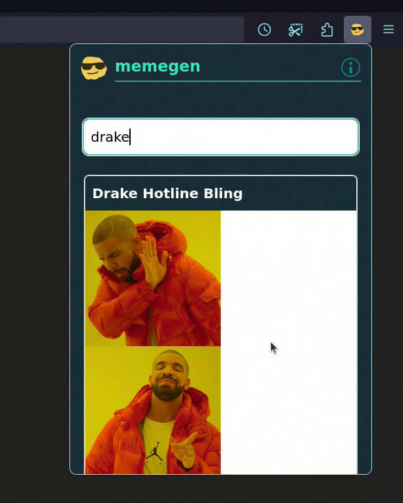
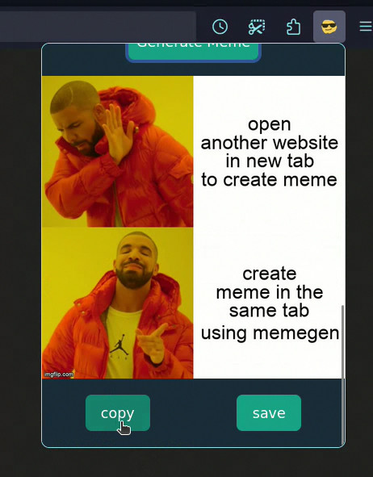
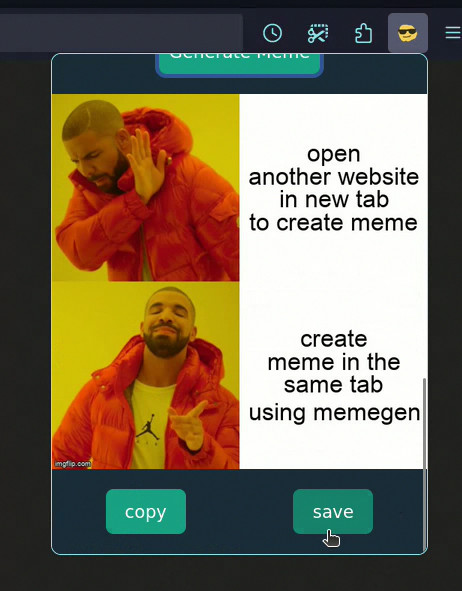

<p align="center"></p>
<h1 align="center">memegen</h1>

<h5>This is a web extension for Chromium and Firefox browsers that allows users to generate memes using trending templates.</h5>

<p align="center">
  </br></br>
  <a href="https://chromewebstore.google.com/detail/memegen/kpccjkkhkacnmkbefpboiejihinkchfo">
    <picture>
      <source srcset="https://i.imgur.com/XBIE9pk.png" media="(prefers-color-scheme: dark)">
      </picture></a>
  <a href="https://addons.mozilla.org/firefox/addon/memegen/">
    <picture>
      <source srcset="https://i.imgur.com/ZluoP7T.png" media="(prefers-color-scheme: dark)">
      </picture></a>
  </br></br>
</p>

### screenshots

<div style="display: flex; justify-content: space-between;">
  
  
  
  
</div>

## Build Requirements

- Node.js (v14 or later)
- pnpm (v6 or later)
- Firefox browser
- Git
- [imgflip](https://imgflip.com/) account

## Supported Operating Systems

This project should work on the following operating systems:

- Linux
- Windows
- macOS

## Build Instructions

#### 1. Clone the repository:

```bash
  git clone https://github.com/bhupeshpr25/memegen.git
```

#### 2. Navigate to the project directory:

```bash
  cd memegen
```

#### 3. Install dependencies

```bash
  pnpm install
```

#### 4. Environment Variables

Create a `.env` file in the root directory of your project and add your [imgflip](https://imgflip.com/) credentials

Example `.env` file:

```plaintext
  VITE_IMGFLIP_USERNAME=your_username
  VITE_IMGFLIP_PASSWORD=your_password
```

#### 5. Run the extension

- Run the development command

```bash
  pnpm dev
```

- This wil open the firefox browser in developer mode

- Click on the extension in the extension menu to run

#### 6. Build the extension

- Run the build command

```bash
  pnpm build
```

- This will update the `dist` folder in the root directory with the necessary changes

## Troubleshooting

### Copy not working?

#### Reason

On some firefox browsers, this feature might be turned off by default.

#### Fix

1. Visit the `about:config` page
2. Search for `dom.events.asyncClipboard.clipboardItem` flag
3. Set it to true

### License

This software is released under the terms of the [MIT License](https://github.com/bhupeshpr25/memegen/blob/main/LICENSE)
